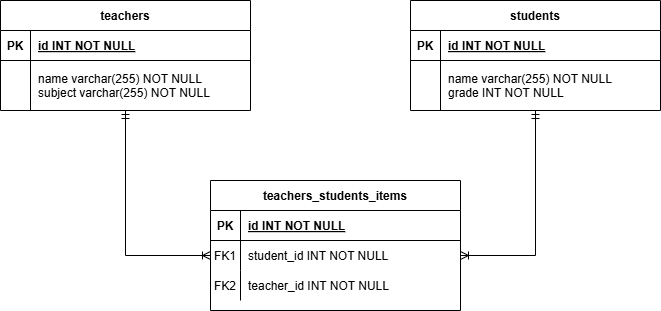

## Description

[API Documentation](https://serene-ocean-50222-5793158abbed.herokuapp.com/api-docs) 
<br>
##### Database Structure #####

<br>
[API Endpoint](https://serene-ocean-50222-5793158abbed.herokuapp.com/teacher)

## Installation

```bash
$ npm install
```

## Running the app

```bash
# development
$ npm run start

# watch mode
$ npm run start:dev

# production mode
$ npm run start:prod
```

## Test

```bash
# unit tests
$ npm run test

# e2e tests
$ npm run test:e2e

# test coverage
$ npm run test:cov
```

## Support

Nest is an MIT-licensed open source project. It can grow thanks to the sponsors and support by the amazing backers. If you'd like to join them, please [read more here](https://docs.nestjs.com/support).

## Stay in touch

- Author - [Dayana Athira](https://github.com/dayanaathira)

## License

Nest is [MIT licensed](LICENSE).
